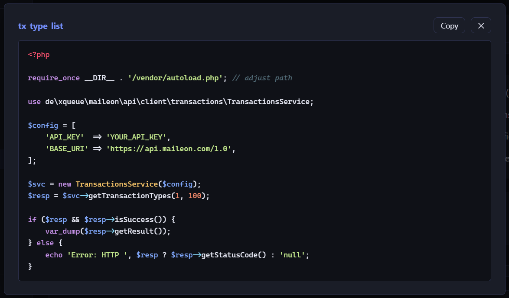
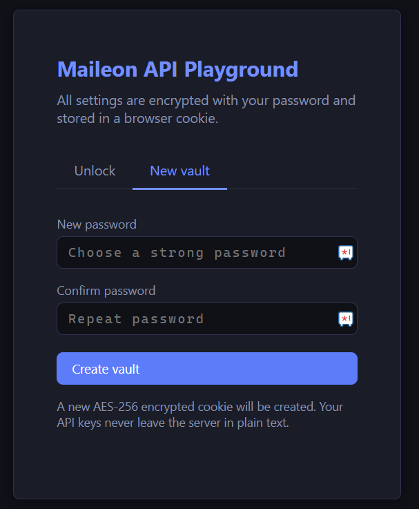
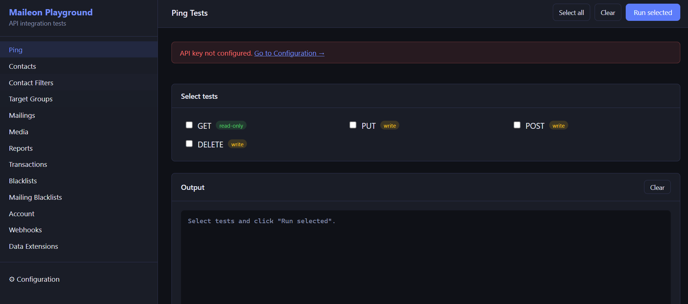
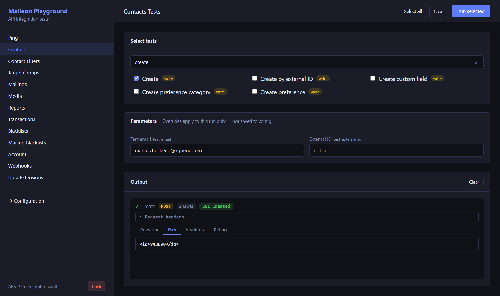

# Maileon PHP API Client — Integration Tests & Examples

Integration tests and a browser-based API playground for the [Maileon PHP API client](https://packagist.org/packages/xqueue/maileon-api-client) ([source on GitHub](https://github.com/xqueue/maileon-php-api-client)).

## Quick start

### Native (PHP built-in server)

Requires PHP 7.4+ and Composer on the host.

```bash
git clone https://github.com/xqueue/maileon-php-api-client-examples.git
cd maileon-php-api-client-examples
composer install
php -S localhost:8000 -t ui/
```

Open `http://localhost:8000`.

### Docker

No PHP or Composer required on the host — only Docker.

```bash
git clone https://github.com/xqueue/maileon-php-api-client-examples.git
cd maileon-php-api-client-examples
docker compose up --build
```

Open `http://localhost:8080`.

The `Dockerfile` uses the official `php:8.2-cli` image, installs Composer inside the container, runs `composer install`, and starts the PHP built-in server on port 8080.

---

After starting with either method, create a vault with a password and enter your Maileon API key in the **Configuration** section. All configuration is stored encrypted in a browser cookie — nothing is written to disk.

For a production or shared server, point your web server's document root at the `ui/` directory instead of using the built-in PHP server.

## Requirements

- PHP 7.4 or 8.x
- Composer
- A Maileon account with an API key

## Setup

```bash
composer install
cp conf/config.php.default conf/config.php
# Edit conf/config.php with your API key and test data IDs.
```

Alternatively, set environment variables (they take precedence over `conf/config.php`):

```bash
cp .env.example .env
# Edit .env
```

---

## Web UI — Maileon API Playground

A single-file browser-based API explorer. Select tests, override parameters per run, inspect requests and responses, and view the raw curl debug log — all without touching the CLI.

It will also provide sample code in PHP, e.g.:



### Starting the UI

**Native:**
```bash
php -S localhost:8000 -t ui/
# Open http://localhost:8000
```

**Docker** (no local PHP/Composer required):
```bash
docker compose up --build
# Open http://localhost:8080
```

Or point any web server's document root at the `ui/` directory.

### First run — create a vault

All configuration (API key, base URI, test data) is stored in an **AES-256-CBC encrypted browser cookie**. The key is derived from your password via PBKDF2-SHA256 (100,000 iterations). Your password is never stored anywhere.

On first visit, choose the **New vault** tab and set a password:



### Main view

After unlocking, the sidebar lists all 13 API service sections. Without a configured API key, a banner links directly to Configuration:



### Configuration

Enter your API key, base URI, and test data IDs. Enable **debug mode** to show the curl verbose log per call. All values are AES-256 encrypted on save:


### Running tests

Select one or more tests, optionally filter with the search box, then click **Run selected**. When tests require specific values (email address, target group name, etc.) a **Parameters** panel appears so you can override them for that run without changing the saved config.

Results display:
- HTTP **method badge** (color-coded GET / POST / PUT / DELETE)
- **Full request URL**
- **Elapsed time** in milliseconds
- **HTTP status badge** (color-coded by class)
- Collapsed **Request headers** section
- Response tabs: **Preview** (deserialized) · **Raw** (XML/JSON body) · **Headers** · **Debug** (curl verbose log)



The **Debug** tab shows the full curl session log with the Authorization header redacted. Useful for verifying exact request headers, SSL handshake, and redirect chains:


### PHP code snippets

Every test entry has a `</>` button next to its label. Click it to open a modal with minimal, copy-pasteable PHP code for that specific API call.

- Parameter values entered in the **Parameters** panel are pre-filled into the snippet.
- The snippet includes all required `use` statements and a standard result-check block.
- Click **Copy** to copy the code to the clipboard, or close the modal by clicking ✕ or anywhere outside it.

This makes it straightforward to transfer a tested call directly into your own project without having to look up the method signature.

---

## Running the PHPUnit integration tests

Integration tests make real API calls. They create, modify, and delete data in your Maileon account.

```bash
# Enable and run all integration tests
MAILEON_RUN_INTEGRATION=1 MAILEON_API_KEY=your-key composer test

# Run a single service
MAILEON_RUN_INTEGRATION=1 MAILEON_API_KEY=your-key composer test:contacts
MAILEON_RUN_INTEGRATION=1 MAILEON_API_KEY=your-key composer test:dataextensions
MAILEON_RUN_INTEGRATION=1 MAILEON_API_KEY=your-key composer test:transactions
```

Without `MAILEON_RUN_INTEGRATION=1`, all tests are marked as **skipped** — safe to run in CI.

## Test coverage

| Service                   | Tests                                                                                    |
|---------------------------|------------------------------------------------------------------------------------------|
| PingService               | GET, PUT, POST, DELETE                                                                   |
| ContactsService           | CRUD, custom fields, sync, unsubscribe, preferences                                      |
| ContactFiltersService     | count, list, get, create, update, refresh, delete                                        |
| TargetGroupsService       | count, list, get, create, delete                                                         |
| MailingsService           | create/delete, HTML, subject, sender, reply-to, preview, tags, locale, custom properties, QoS, archive URL, report URL, domain, copy, contact filter restrictions |
| MediaService              | list CMS1 templates, list CMS2 templates                                                 |
| ReportsService            | unsubscribers, subscribers, recipients, opens, clicks, bounces, blocks, conversions      |
| TransactionsService       | type CRUD (simple + complex), create transactions, recent, get/delete by ID              |
| BlacklistsService         | list, get, add entries                                                                   |
| MailingBlacklistsService  | CRUD, add entries, get entries                                                           |
| AccountService            | info, placeholder CRUD, mailing domains                                                  |
| WebhooksService           | list, get, create, update, delete                                                        |
| DataExtensionsService     | list (paginated), get data types, create, get, update (description + add fields), delete, synchronize records (UPSERT, INSERT_IGNORE_DUPLICATES), get records (filtered, sorted), delete all records, empty payload guard |

## Test data

Some tests require pre-existing objects in your account:

| Env var                     | Required for                          |
|-----------------------------|---------------------------------------|
| `MAILEON_TEST_MAILING_ID`   | All Reports tests                     |
| `MAILEON_TEST_CF_ID`        | ContactFilters — get by config ID     |
| `MAILEON_TEST_BLACKLIST_ID` | Blacklists — get, add entries         |
| `MAILEON_TEST_DE_ID`        | All DataExtensions tests              |
| `MAILEON_TEST_TX_TYPE_ID`   | Transactions — get type from config   |
| `MAILEON_TEST_TX_ID`        | Transactions — get/delete by ID       |
| `MAILEON_TEST_WEBHOOK_ID`   | Webhooks — get from config            |

Tests that require these IDs are automatically **skipped** when the IDs are not set.

## Safety

Tests create and clean up their own data. Cleanup runs in `tearDownAfterClass()` even if tests fail.

The following operations affect **real account data** — review before running:

- `ContactsService`: creates and deletes test contacts
- `TransactionsService`: creates transaction types and sends transactions
- `MailingsService`: creates and deletes mailings
- `BlacklistsService`: adds entries to a blacklist (requires `MAILEON_TEST_BLACKLIST_ID`)
- `DataExtensionsService`: creates and deletes a temporary data extension for CRUD tests; also writes records to an existing extension (requires `MAILEON_TEST_DE_ID`)
